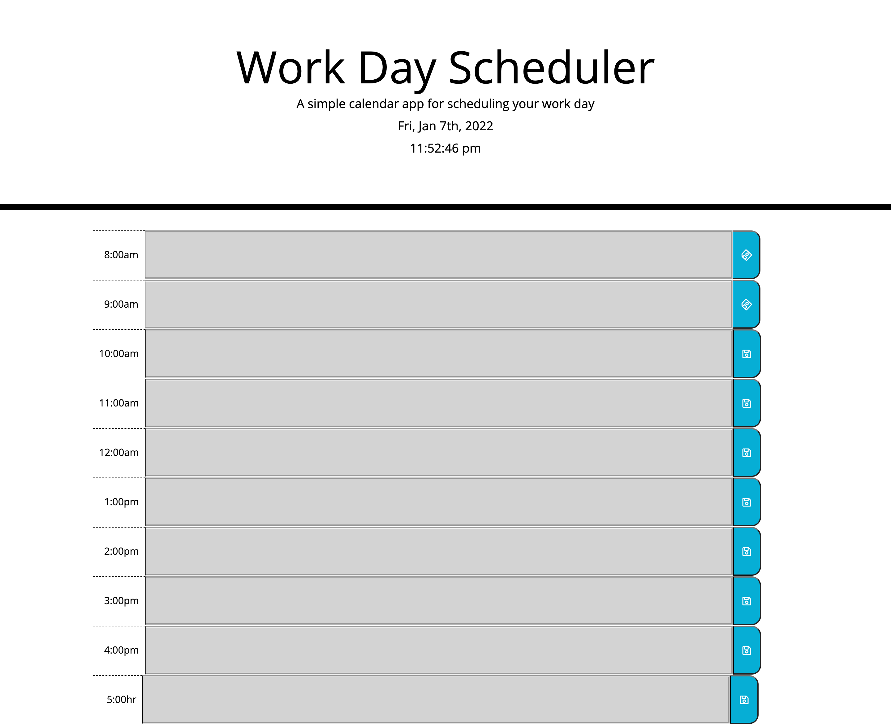
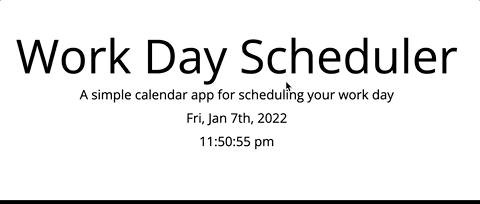
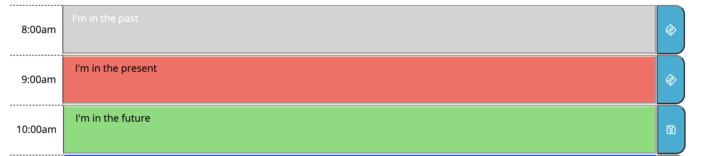

# Daily Production Tracker

First step in being succesful is to know how to organize your time!
With dynamic day planer you'll be able to see current day and time. User will also see the color coded time block indicting past task, current task and future task. # 

---

## Table of Contents

* [Built with](#built-with)
* [Live link](#deployed-link)
* [Site Layout](#layout)
* [Functionality](#functionality)
* [Learning points](#learning-points)

---
## Built With

* [HTML](https://developer.mozilla.org/en-US/docs/Web/HTML)
* [CSS](https://developer.mozilla.org/en-US/docs/Web/CSS)
* [Javascript](https://developer.mozilla.org/en-US/docs/Web/JavaScript)
* [Jquery](https://jqueryui.com/)
* [bootstrap](https://getbootstrap.com/)
* [moment.js](https://momentjs.com/)
---
## Deployed Link

* [Daily-planner]( https://705h-s.github.io/Daily-Production-Tracker/)




---

## Layout

At the top of the page user will be greated with a title and description of the app. Current Day and time will be shown as well. At the bottom of the site User will find 9 time blocks 9am-5pm. 
In the center of the time block user can input notes. And later save.

---

## Functionality

### Current Day and Dynamic Time display 

When user loads app they're greeted with realtime clock and day 




 > using moment.js I can display and format time !

```javascript

  // displays dynamic current time 
        let updateTime = function () {
            let currentTime = moment().format('h:mm:ss a ')
            $("#currentTime").text(currentTime)
        }
        updateTime();

        setInterval(updateTime, 500);
    // end of current time display 
      
   
```

---


### Dynamic colored time blocks

Depending on the time of day. The Time blocks are colored coded. If it is 9:25pm then that time block would be red indicating that it's the present time. If the time has passed then the time block would be grey. Time blocks that have yet to be come are green indicating they're in the future.




---

### Learning points 

 I wanted to experiment and try to use [Jquery](https://jqueryui.com/).
 Even though I have yet to learn vanilla javascript I have found using Jquery to be easier.
 I've also learned the use of if and else if. I knew the idea of it but I wasn't sure how it worked till now.
 I also learned how to use [moment.js](https://momentjs.com/). I thought using that api was fun. 

---

## License
for UC Berkely Extention bootcamp program

---
##### Author Joshua Meza
[GitHub](https://github.com/705h-S)